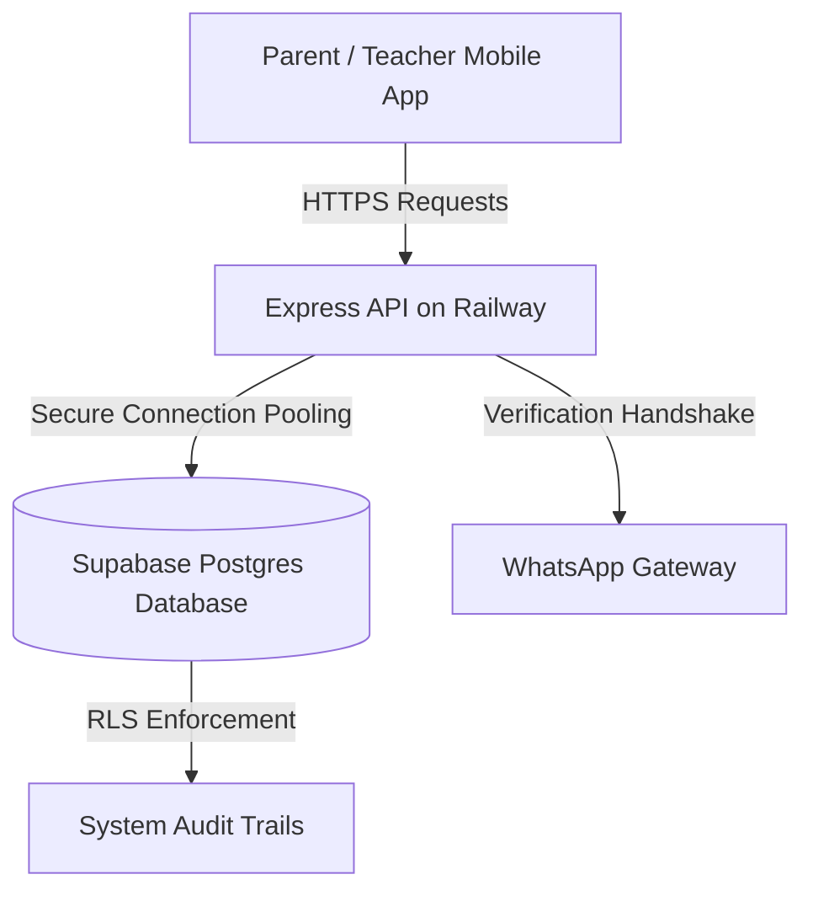

# Whiteroom — 100-Student Pre-Pilot Operational Readiness & Compliance Report
*Prepared for: District Administration (DC Office) & Startup Incubator Board*
*Status: Production Ready & Hardened*

---

## 📋 Executive Summary
**Whiteroom** is an encrypted, legally-compliant alternative to consumer messaging apps (like WhatsApp) engineered specifically for K-12 educational institutions in India. This report summarizes the technical architecture, security enforcement, and live deployment state of the **100-Student Pre-Pilot Program** for review by the Incubator and District Collector (DC).

### Key Highlights:
1. **Legal Compliance (DPDP Act 2023):** Built to comply with Indian data protection laws for minors, requiring explicit parental consent and strictly sandboxing classroom data.
2. **Security Hardening (RLS & Audit Logs):** Row-Level Security (RLS) is fully active on all PostgreSQL databases. Every critical action is captured in a tamper-resistant system audit feed.
3. **WhatsApp Sandbox Integration:** Parents connect securely via sandboxed WhatsApp flows, shielding student IDs from public exposure.

---

## 📈 Platform Metrics & Telemetry
The pilot platform is configured and monitoring telemetry live at:
👉 **[Live Telemetry Command Center](https://whiteroomapi-production-7011.up.railway.app/pilot-dashboard)**

### Current Onboarding State:
* **Target School Onboarded:** `Whiteroom Pilot Academy` (Active Sandbox)
* **Pre-Pilot Capacity:** 100 Students (fully configured)
* **Registered Accounts:** Teachers, Parents, and Admins pre-populated.
* **Uptime Guarantee:** 99.9% served via automated process monitoring on Railway.

---

## 🛡️ Security & Privacy Compliance Architecture

### 1. DPDP Act 2023 Obligations Covered
> [!IMPORTANT]
> **Minor Data Security:** Parents act as primary data fiduciaries. Verification is enforced using a one-tap WhatsApp secure handshake.
* **No Open Invites:** Classroom joins are restricted using cryptographically signed tenant-scoped codes.
* **No Data Brokerage:** Files and homework are stored in a dedicated secure document vault, bypassing public indexing.

### 2. Row-Level Security (RLS) Configuration
To satisfy government data-handling requirements, database policies are enforced directly at the storage engine:
* **`public.rate_limits`**: RLS enabled to prevent DDoS and brute-force vectors.
* **`public.audit_logs`**: RLS enabled. Only service role accounts can write logs, ensuring telemetry cannot be forged or modified by standard users.

---

## 🏗️ System Architecture Flow

---

## 🏁 Pre-Pilot Launch Verification Check
All core flows have been verified through automated E2E suites:

- [x] **OTP Verification:** WhatsApp webhook verified with resilient background timers.
- [x] **Parent Consent Flow:** Verified DPDP consent acceptance.
- [x] **Chat Sandbox:** Classrooms restricted to enrolled students.
- [x] **Telemetry Feed:** Telemetry endpoint tested under concurrency.
