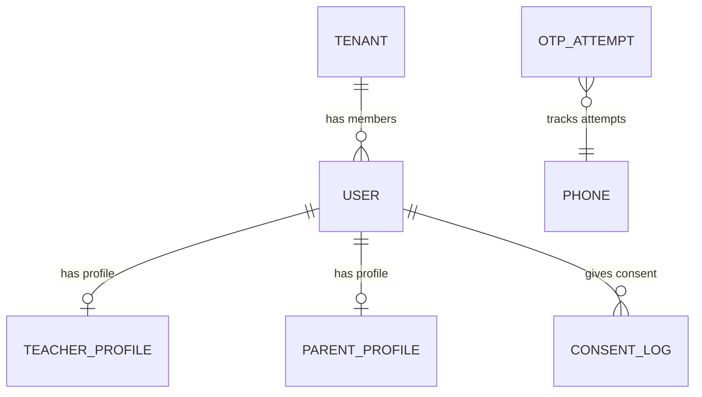

# Implementation Plan: Auth & Multi-tenancy

**Feature Branch**: `001-auth-multitenancy`  
**Phase**: 2 of 5  
**Prerequisite**: Phase 1 (Foundation) — ✅ Complete

---

## Research

### Technology Decisions

| Decision | Choice | Rationale |
|----------|--------|-----------|
| JWT library | `jose` (v6+) | Edge-compatible, zero native deps, TypeScript-first. Constitution forbids external state stores, so stateless JWT is required. |
| OTP hashing | `node:crypto` `createHash("sha256")` | OTPs are short-lived (5min), SHA-256 is sufficient. No need for bcrypt. |
| Phone hashing | `node:crypto` `createHash("sha256")` | For lookup column. Constitution requires phone stored hashed. |
| Slug generation | Deterministic from name (`slugify`) | Custom function — lowercase, strip non-alphanumeric, hyphenate. No external dep needed. |
| Invite code generation | `node:crypto` `randomBytes` | 6-char alphanumeric from a cryptographic random source. |
| OTP storage | New `otp_attempts` table in PostgreSQL | Constitution forbids Redis. Store OTP hash + timestamp + attempt count in DB. |
| Request validation | `zod` (already installed) | Validate all request bodies at the route level. |

### Schema Analysis

The Phase 1 schema already includes all tables needed for Phase 2:
- `users` — has `phone`, `role`, `tenantId`, `refreshToken` columns
- `tenants` — has `inviteCode`, `brandColor`, `logoUrl`, `slug`
- `teacher_profiles` — links user → tenant
- `parent_profiles` — links user → tenant
- `consent_logs` — has `consentType`, `grantedAt`, `userId`, `tenantId`

**New table needed**: `otp_attempts` — tracks OTP requests per phone for rate limiting.

### Dependency Assessment

New `npm` packages to install in `apps/api`:
- `jose` ^6.0 — JWT sign/verify (ESM-native, no native bindings)

No other external dependencies required. `node:crypto` handles hashing, `zod` handles validation (already installed).

---

## Data Model

### New Table: `otp_attempts`

```
otp_attempts
├── id          text PK (CUID2)
├── phoneHash   text NOT NULL (SHA-256 of normalized phone)
├── otp         text NOT NULL (SHA-256 of the OTP)
├── expiresAt   timestamp NOT NULL (createdAt + 5 minutes)
├── verified    boolean DEFAULT false
├── createdAt   timestamp DEFAULT now()
```

**Index**: `phoneHash` + `createdAt` composite for rate-limit queries.

### Schema Relationships (Phase 2 focus)



---

## Architecture

### Auth Flow: Teacher Onboarding

```
Client                    API                          DB
  │                        │                            │
  ├─ POST /auth/otp/send ─►│                            │
  │   { phone }            ├─ normalize phone           │
  │                        ├─ hash phone                │
  │                        ├─ check rate limit ─────────►│ COUNT otp_attempts WHERE phoneHash AND createdAt > 1hr ago
  │                        │◄──────────────────────────── │ count < 3? proceed
  │                        ├─ generate 6-digit OTP       │
  │                        ├─ hash OTP                   │
  │                        ├─ INSERT otp_attempts ──────►│
  │                        ├─ call MSG91 REST API        │
  │◄── 200 { sent: true }─┤                            │
  │                        │                            │
  ├─ POST /auth/otp/verify►│                            │
  │   { phone, otp }       ├─ normalize + hash phone    │
  │                        ├─ hash OTP                   │
  │                        ├─ SELECT otp_attempts ──────►│ WHERE phoneHash AND otp AND !verified AND !expired
  │                        │◄──────────────────────────── │ found? mark verified
  │                        ├─ SELECT users ─────────────►│ WHERE phone = normalized
  │                        │◄──────────────────────────── │ exists? → returning user
  │                        │                            │ not exists? → new teacher flow:
  │                        ├─ BEGIN TRANSACTION ────────►│
  │                        │  INSERT tenant              │
  │                        │  INSERT user (role=teacher)  │
  │                        │  INSERT teacher_profile      │
  │                        ├─ COMMIT ──────────────────►│
  │                        ├─ sign JWT (access + refresh) │
  │                        ├─ UPDATE user.refreshToken ─►│
  │◄── 200 { tokens } ────┤                            │
```

### Auth Flow: Parent via Invite

Same OTP flow, but `otp/verify` receives `inviteCode` in body:
1. Resolve invite → get tenant
2. After OTP verify, if new user:
   - INSERT user (role=parent, tenantId from invite)
   - INSERT parent_profile
   - INSERT consent_log (type: `data_processing`, mechanism: `otp_verification`)
3. If returning user (same phone, different tenant) → not supported in v1, return 409

### JWT Structure

```json
{
  "userId": "cuid2...",
  "tenantId": "cuid2...",
  "role": "teacher",
  "iat": 1716000000,
  "exp": 1716000900
}
```

- **Access token**: 15-minute TTL, signed with `JWT_ACCESS_SECRET`
- **Refresh token**: 30-day TTL, signed with `JWT_REFRESH_SECRET`, stored hashed in `users.refreshToken`

### Auth Middleware Update

The existing placeholder `auth.ts` will be replaced with real JWT verification:
1. Extract `Bearer <token>` from `Authorization` header
2. Verify with `jose.jwtVerify()` using `JWT_ACCESS_SECRET`
3. Set `c.set("user", payload)` for downstream route handlers
4. A `requireRole("teacher")` helper will gate teacher-only endpoints

---

## File Plan

### New Files

| File | Responsibility |
|------|----------------|
| `packages/db/src/schema/otp-attempts.ts` | OTP attempt tracking table schema |
| `apps/api/src/lib/jwt.ts` | JWT sign/verify functions using jose |
| `apps/api/src/lib/otp.ts` | OTP generation, hashing, phone normalization |
| `apps/api/src/lib/msg91.ts` | MSG91 HTTP client for sending SMS |
| `apps/api/src/routes/auth/index.ts` | Auth route registrar |
| `apps/api/src/routes/auth/otp-send.ts` | POST /api/v1/auth/otp/send |
| `apps/api/src/routes/auth/otp-verify.ts` | POST /api/v1/auth/otp/verify |
| `apps/api/src/routes/auth/refresh.ts` | POST /api/v1/auth/refresh |
| `apps/api/src/routes/auth/logout.ts` | POST /api/v1/auth/logout |
| `apps/api/src/routes/tenant/index.ts` | Tenant route registrar |
| `apps/api/src/routes/tenant/get-me.ts` | GET /api/v1/tenants/me |
| `apps/api/src/routes/tenant/update-me.ts` | PATCH /api/v1/tenants/me |
| `apps/api/src/routes/invite/index.ts` | Invite route registrar |
| `apps/api/src/routes/invite/generate.ts` | POST /api/v1/invite |
| `apps/api/src/routes/invite/resolve.ts` | GET /api/v1/invite/:code |
| `apps/api/src/seed.ts` | Demo data seeder |

### Modified Files

| File | Changes |
|------|---------|
| `apps/api/src/middleware/auth.ts` | Replace placeholder with real JWT verification |
| `apps/api/src/index.ts` | Mount auth, tenant, invite routes |
| `apps/api/src/lib/env.ts` | Add MSG91 env vars |
| `apps/api/package.json` | Add `jose` dependency, add `seed` script |
| `packages/db/src/index.ts` | Export `otpAttempts` schema |
| `.env.example` | Add MSG91 variables |

---

## API Contracts

### POST `/api/v1/auth/otp/send`

**Auth**: None

```typescript
// Request
{ phone: string }

// Response 200
{ success: true, data: { sent: true, expiresIn: 300 } }

// Response 429
{ success: false, error: { code: "OTP_RATE_LIMITED", message: "...", details: { retryAfter: 1800 } } }
```

### POST `/api/v1/auth/otp/verify`

**Auth**: None

```typescript
// Request
{ phone: string, otp: string, inviteCode?: string }

// Response 200
{ success: true, data: { accessToken: "...", refreshToken: "...", user: { id, role, tenantId }, isNewUser: boolean } }

// Response 400
{ success: false, error: { code: "INVALID_OTP" | "OTP_EXPIRED", message: "..." } }
```

### POST `/api/v1/auth/refresh`

**Auth**: None (refresh token in body)

```typescript
// Request
{ refreshToken: string }

// Response 200
{ success: true, data: { accessToken: "..." } }

// Response 401
{ success: false, error: { code: "TOKEN_EXPIRED", message: "..." } }
```

### POST `/api/v1/auth/logout`

**Auth**: Bearer token

```typescript
// Response 200
{ success: true, data: { loggedOut: true } }
```

### GET `/api/v1/tenants/me`

**Auth**: Bearer token

```typescript
// Response 200
{ success: true, data: TenantInfo }
```

### PATCH `/api/v1/tenants/me`

**Auth**: Bearer token (teacher only)

```typescript
// Request (all fields optional)
{ name?: string, logoUrl?: string, brandColor?: string }

// Response 200
{ success: true, data: TenantInfo }
```

### POST `/api/v1/invite`

**Auth**: Bearer token (teacher only)

```typescript
// Response 200
{ success: true, data: { inviteCode: string, shareUrl: string } }
```

### GET `/api/v1/invite/:code`

**Auth**: None

```typescript
// Response 200
{ success: true, data: { tenantName: string, logoUrl: string | null, brandColor: string } }

// Response 404
{ success: false, error: { code: "INVITE_NOT_FOUND", message: "..." } }
```

---

## Constitution Compliance Check

| Principle | Status |
|-----------|--------|
| I. Monorepo-First | ✅ All new code stays within existing workspace packages |
| II. Shared Types as Contract | ✅ JWTPayload, OTPSendRequest, OTPVerifyRequest, AuthTokens already defined in `@whiteroom/shared` |
| III. Tenant Isolation | ✅ All tenant-scoped queries filter by `tenantId` from JWT claims |
| IV. Schema-Before-Code | ✅ `otp_attempts` schema defined before route handlers |
| V. Offline-Safe by Default | ✅ OTP verify is idempotent (marking already-verified OTP returns the same tokens) |
| VI. No PII Beyond Minimum | ✅ Phone stored hashed for lookup, OTP stored hashed, no PII in logs |
| VII. Phase-Gated Delivery | ✅ This is Phase 2, building strictly on Phase 1 foundations |
